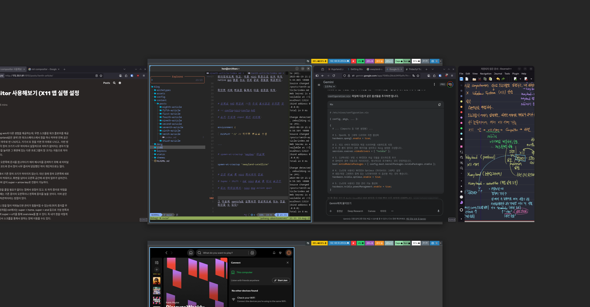

+++
title = 'niri compositor 사용해보기 (X11 앱 실행 설정 포함)'
date = 2025-08-19T21:19:22+09:00
draft = false
+++



## niri compositor

niri wm은기존의 tiling wm과 다른 경험을 제공하는데, 무한 스크롤링 워크 플로우를 제공한다. 기존의 WM의 경우에는 (hyprland같은 경우) 한 워크스페이스에서 창을 하나 띄우면 전체 공간을 채우고, 그 다음에 창을 띄우면 좌우로 반 나눠지고, 거기서 또 창을 키면 위 아래로 나뉘고.. 이런 방식으로 창이 나눠지는데, 이러면 각 창의 크기가 너무 작아져서 실질적으로 의미가 없어지는 경우가 많다. 한 화면에서 한 프로그램의 창을 늘리면 그 화면에 있는 다른 프로그램의 창 크기는 자동으로 작아지는 구조. 이것이 은근히 불편하다.


예를 들어, 왼쪽에 코드를 띄우고 오른쪽에 문서를 참고하다가 에러 메시지를 검색하기 위해 새 터미널이나 브라우저 창을 열면, 기존의 코드와 문서 창이 너무 좁아져 답답했던 적이 개인적으로는 많다.


반면에 niri는 새 창을 띄운다고 해서 기존 창의 크기가 작아지지 않는다. 대신 원래 창의 오른쪽에 새로운 프로그램의 원래 크기 대로 창이 띄워지고, 화면을 넘어서 오른쪽 공간에 새 창의 일부가 넘어간다. 프로그램끼리의 전환은 기존 WM와 같이 super + arrow key로 전환이 가능하다. 


따라서 집중해서 작업하고 있는 창을 줄일 필요가 없다는 점에서 장점이 있고, 또 마치 종이로 작업을 할 때는 새로운 참고물을 추가할 때는 기존 종이의 오른쪽이나 왼쪽에 종이를 놓을 것이다. 이와 같은 경험을 컴퓨터에서도 할 수 있어 직관적이라는 장점이 있다. 


다만, 무한 스크롤링 방식이다보니 창을 많이 띄워놓으면 관리가 힘들어질 수 있는데 (마치 종이를 무분별하게 펼쳐놓으면 보기 힘든 것처럼) niri에서는 super + home, super + end 등으로 가장 왼쪽과 오른쪽의 창으로 이동할 수 있으며 super + o키를 통해 overview를 볼 수 있다. 즉 내가 창을 어떻게 띄워놨는지 확인이 가능하고 여기서 스크롤을 통해서 원하는 창에 이동할 수도 있다.


또한 niri는 수직 방향으로 워크스페이스를 구분한다. 하나의 워크스페이스에서는 가로 방향으로 무한한 스크롤링 방식을 제공한다. 다른 워크스페이스로 이동할 때는 좌우가 아닌 위 아래로 이동한다. 이 방식이 기존의 숫자로 구분하는 워크스페이스보다 직관적으로 느껴져 편한 경험을 제공한다. 


다만 niri에도 단점이 있다. 가장 큰 단점으로는 기존 legacy x11 프로그램 지원을 기본적으로 하지 않는다는 것이다. niri에서는 기본적으로 xwayland-satellite 라는 패키지를 통해서 문제를 해결하도록 안내하고 있다. 하지만 다른 WM에서는 기본적으로 제공하는 X11 프로그램 실행을 지원하지 않는다는 점에서 번거로움이 추가되는 것이며, xwayland-satellite 설정을 한다고 해서 X11 프로그램이 원활히 실행될 것이라는 보장도 없다. 


또한, overview 기능이 있다고 해도 창을 수십개를 띄워놓고 작업을 하는 사람이나, 한 화면에서 여러 창을 동시에 띄워서 작업하는 사람들 (예를 들면 트레이딩을 하는 사람) 에게는 스크롤링 WM보다는 기존 tiling WM이 적합할 것이다.


niri에서는 기본적으로 spotify 실행이 안된다. spotify가 X11 프로그램이기 때문이다. 따라서 이번 글에서는 spotify를 xwayland-satellite를 통해서 실행하는 방법에 대해서 소개하겠다.


## xwayland-satellite


xwayland-satellite란, 독립적으로 xwayland를 실행하여, X11 앱이 보내는 명령어를 wayland 명령어로 변환하여 컴포지터(niri)에 전달하는 프로그램을 의미한다.


### X11


위의 정의만 들으면 무슨 말인지 이해하기가 어려울 것이다. 이는 사실 컴퓨터의 역사를 살펴보면 더 이해하기가 쉽다.


wayland 프로토콜이 탄생하기 전, 리눅스에서는 GUI 앱 실행을 위해서 X11 방식을 사용했다. X11은 서버 - 클라이언트 구조로 되어있어, 클라이언트가 프로그램에 대한 GUI 창을 띄워달라고 요청하면 서버가 이를 처리하고 띄우는 방식이었다.


X11이 탄생한 1987년 그 당시에는 연산을 수행할 수 있는 컴퓨터가 매우 비싸서 당시에는 하나의 고가 컴퓨터를 여러 사람이 공유해서 사용을 했었다. 중앙 컴퓨터는 연산을 담당하고, 개인이 갖고 있는 컴퓨터는 키보드, 화면만 있어 독립적인 연산은 거의 불가능했다. 그래서 중앙 컴퓨터에서 프로그램을 실행하고, 개인 컴퓨터에서는 그 프로그램의 그래픽 인터페이스만을 띄우는 방식으로 컴퓨터를 사용했다. 초고가이던 컴퓨터에 비해 키보드, 디스플레이는 상대적으로 저렴했기 때문이다.


예를 들자면, MIT 중앙 컴퓨터에서 텍스트 에디터를 실행하면 편집 창은 개인 터미널 화면에 나타나는 방식이었다.


이런 상황에서는 중앙 컴퓨터가 X11 클라이언트이고, 각 컴퓨터가 X11 서버이다. 중앙 컴퓨터에서 프로그램을 실행해서 나온 그래픽 렌더링 관련 명령어가 있을 것이다. 이것을 X11 서버에 요청해서 X11 서버는 이 명령어를 처리해서 개인 컴퓨터의 화면에 띄우는 방식이었다.


여기서 '서버'는 그래픽을 화면에 '제공(serve)'해주는 주체, 즉 사용자의 모니터와 키보드가 연결된 단말기를 의미한다. 반면 '클라이언트'는 그래픽을 출력하라고 단말기에 '요청(request)'하는 프로그램이다.


컴퓨터의 성능이 비약적으로 상승하면서 더 이상 개인들이 중앙의 컴퓨터에 접속해서 작업을 할 필요가 없어졌고 (일반적인 경우) 따라서 하나의 호스트에서 X11 서버와 클라이언트가 동시에 실행되게 되었다. 


### xwayland


기존에 존재하던 X11의 문제들을 해결하기 위해 2008년  wayland 라는 프로토콜이 새로 등장하였으며, 이 wayland가 현재 리눅스 데스크탑의 새로운 표준이 되어가고 있다. 그러나 2025년 기준, X11가 탄생한지 40년이 넘어가는 상황에서, 현재도 레거시 X11 프로그램이 다수이다. wayland 초창기에는 이 문제가 더욱 심각했을 것이어서, X11 앱을 wayland에서 실행할 수 있도록 하는 방법이 필요했는데, 여기서 등장한 것이 xwayland이다. 


xwayland는 겉보기에 X11 서버로 동작하나, 내부적으로는 X11 앱으로부터 받은 명령어를 wayland 명령어로 변환하는 역할을 한다. 


### 결론적으로.. 


xwayland-satellite는 독립적인 프로그램으로, 내부적으로는 xwayland 서버를 실행한다. X11 앱들로부터 받은 명령어를 wayland로 변환하고, 이를 컴포지터에 전달하는 역할을 한다. 반대로 컴포지터로부터 받은 명령어 (마우스, 키보드 입력 등)을 X11 앱이 이해할 수 있는 명령어로 변환한 뒤 전달한다.


## xwayland-satellite 설치 및 설정


우선, 이번 글은 Arch Linux를 기준으로 작성되었다는 점을 먼저 알린다.


우선, xwayland-satellite 패키지를 설치하자. 


```console

# pacman -S xwayland-satellite

```


X11의 경우에는 서버처럼 작동을 하는데, 즉 GUI 프로그램들이 실행되는 번호가 몇 번인지에 대한 정보가 필요하다.


X11 몇 번 서버를 사용해야 하는 지를 확인하려면 다음의 명령어를 입력하자.


```console

$ xwayland-satellite


...

2025-08-19T11:07:34.344Z INFO  xwayland_satellite         > Connected to Xwayland on :1

...

```


나의 경우에는 xwayland-satellite가 1번 서버에 연결된 것을 확인할 수 있다.


**주의**: 서버 번호는 환경에 따라 다를 수 있음.

- :0이 이미 사용 중인 경우 (디스플레이 매니저 등) :1, :2 순서로 배정됨.

- 각자의 환경에서 실제 연결된 번호를 확인하여 설정해야 함


xwayland-satellite는 가상 서버를 구축하여, X11 앱들이 xwayland-satellite의 가상서버에서 렌더링되도록 하고, 이를 niri 환경으로 넘겨 마치 native gui 앱을 쓰는 것과 같은 경험을 제공한다.


확인한 서버 번호를 통해서 다음 설정을 하자.


```bash

# 실제로 kdl 파일은 //가 주석 표시임을 유의할 것

# ~/.config/niri/config.kdl

# 초기 주석과 input 섹션 사이에 


environment {

  DISPLAY ":1" // 확인한 번호로 수정


...


# spawn-at-startup "waybar" 다음에


spawn-at-startup "xwayland-satellite"


# 설정 완료 후 niri 재시작이 필요

# Super + Shift + E로 niri 종료 후 다시 로그인

# 또는 터미널에서: niri msg action quit

```


그 다음에 spotify를 실행하면 정상적으로 되는 것을 확인할 수 있다!


## 마무리

오늘은 스크롤링 워크플로우라는 독특한 경험을 제공하는 Wayland 컴포지터 niri를 살펴봤다. tiling WM의 창 분할 방식에 답답함을 느꼈다면 niri는 신선한 대안이 될 수 있다.


비록 X11 앱을 실행하기 위해 xwayland-satellite라는 추가 설정이 필요했지만, 이 과정을 통해 Wayland와 X11의 작동 방식을 더 깊이 이해하는 계기가 되었다. 이 글을 통해 여러분도 niri 환경에서 Spotify 같은  레거시 X11 프로그램을 문제없이 사용할 수 있기를 바란다.
